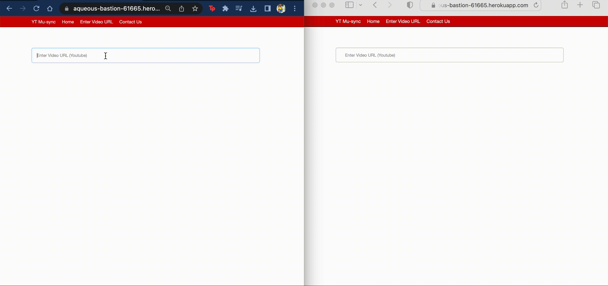

# Youtube mu-sync

Started off as an attempt to synchronize listening on Youtube Music, but the final version instead gives you the ability to watch Youtube videos in sync. Also has features to play/pause/stop that is broadcasted to everyone watching the video!

## Heroku

The app is hosted on [heroku](https://aqueous-bastion-61665.herokuapp.com/).

## Running the app locally

Clone the repo and cd into the local folder

```
git clone https://github.com/revathivijay/yt-musync.git

cd yt-musync
```

Install the necessary node packages

```
npm install
```

Running the app

```
node index.js
```

(OR) Run the app using nodemon (default PORT is 8080)

```
npm install -g nodemon
nodemon index.js localhost [PORT]
```

## Demo

(Demos are a bit laggy, try using the [link](https://aqueous-bastion-61665.herokuapp.com/) to try it out yourself!)

**Enter the URL to your youtube video, which is broadcasted to everyone connected to the app at the time.**



**Play/Pause/Stop**

 

**Seek**


